# HW5 Results Log

## Task 0: Attention Map Visualization

Pretrained and random attention maps are included below.

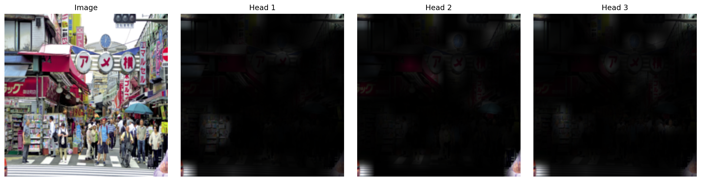
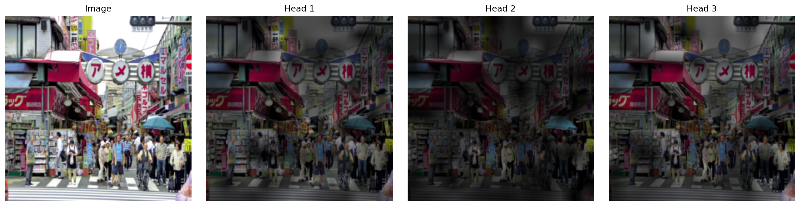
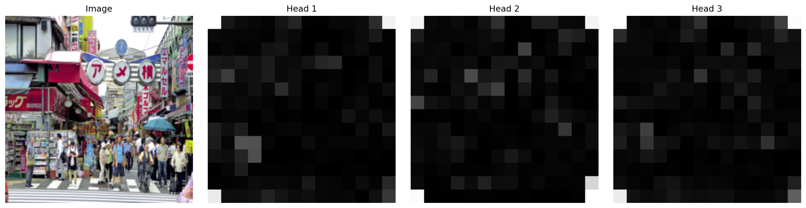
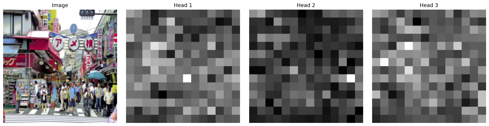

The pretrained ViT attention maps are more structured than the random model, but the three heads still look fairly similar. The random model is more diffuse and noisy, with weaker spatial focus.

## Task 1: End-to-End ViT

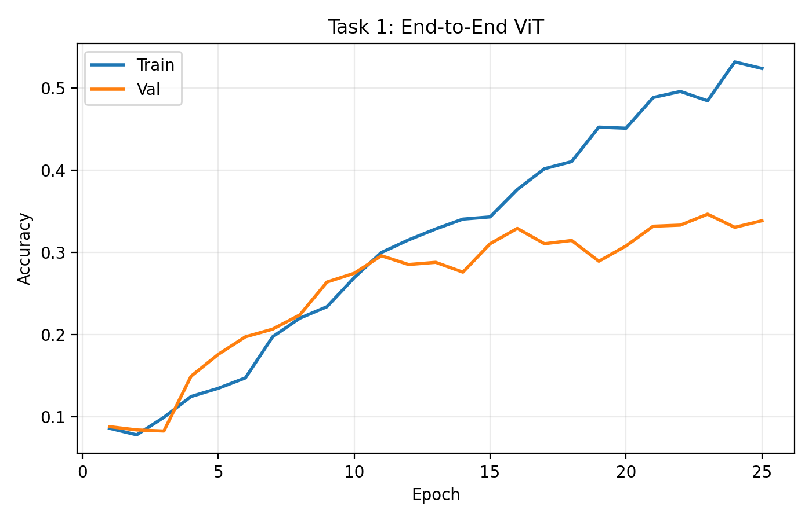

The end-to-end ViT reached about 34% validation accuracy, which matches the expected range. This is much lower than the HW4 CNN baseline, which supports the claim that ViTs struggle more than CNNs in this small-data setting.

## Task 2: Rotation Prediction

Rotation-pretrained attention maps are included in the Task 4 comparison figures below. The frozen rotation probe reached about 28.7% validation accuracy, clearly above the frozen random baseline, so the rotation task learned useful features.

## Task 3: Mini-DINO Pretraining

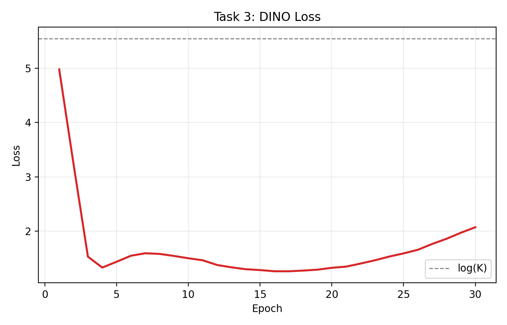
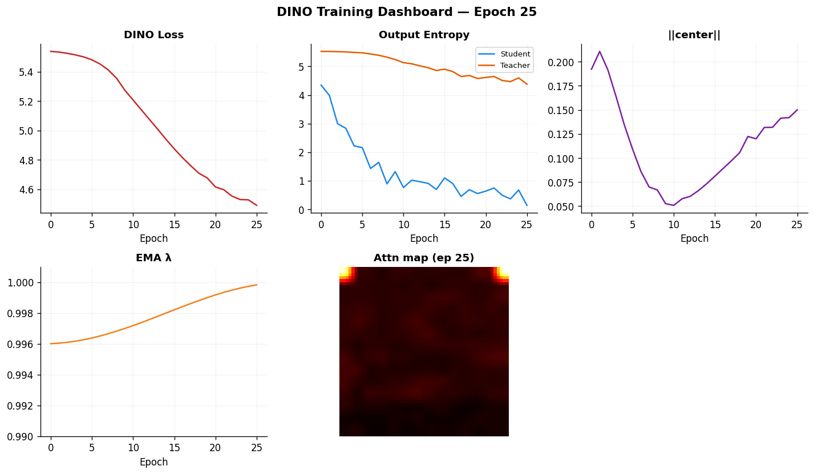
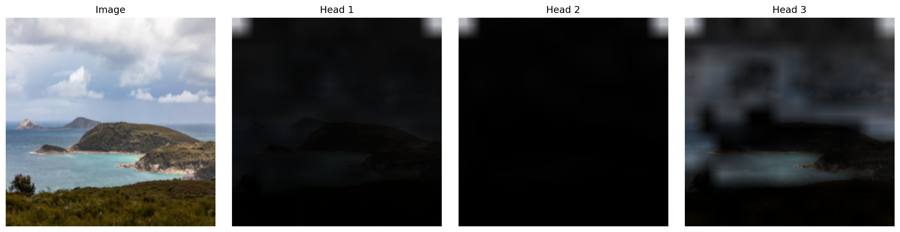
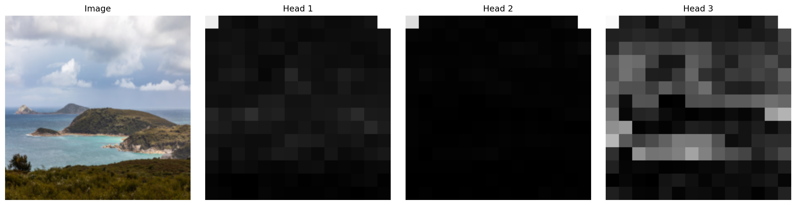

The DINO loss stayed well below log(K) instead of collapsing to 0 or 5.5, and the dashboard showed some evolving attention structure. However, the learned encoder did not transfer well to 15-scenes, so this mini-DINO setup did not produce strong transferable features in my final runs.

## Task 4: Transfer Evaluation

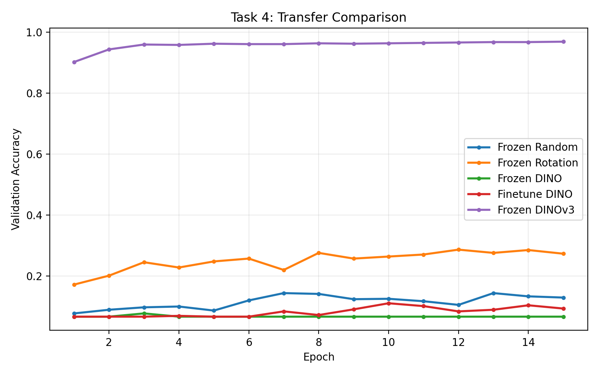
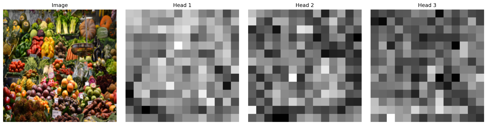
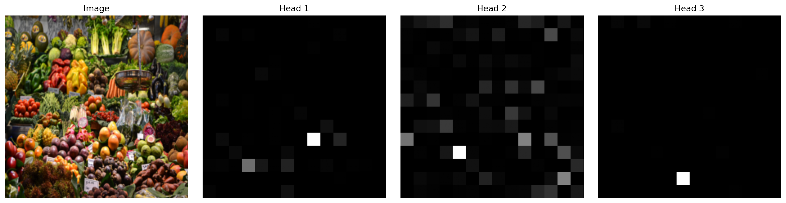
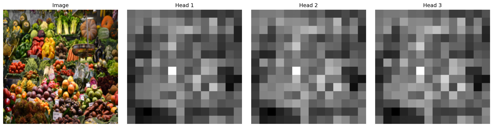
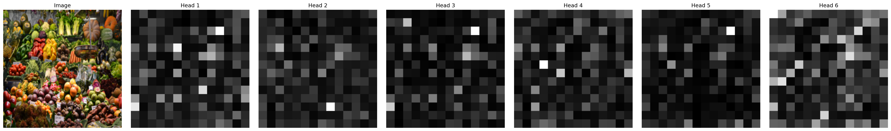

The frozen random probe performed near chance, while frozen rotation improved substantially. My mini-DINO model did not improve transfer over random, but the frozen DINOv3 model was by far the strongest and produced the most semantic attention maps.

## Extra Credit

No extra credit attempted.

---
# CSCI 1430 Results Log

This log help us to grade your work; it is not a report or write up.
- Be brief and precise.
- Be anonymous.

For each homework:
- Include the homework required items.
- Report if you attempted extra credit, let us know where it is in your code, and show its results.
- Any other information that you'd like us to have in grading, e.g., anything unusual or special, please let us know.

**Make sure** to commit all the required files to Github!

## Required homework items

In response to question x, here's my text answer.

In response to question x, here is a required image.


I could also provide a code snippet here, if I need to.
```
one = 1;
two = one + one;
if two == 2
    disp( 'This computer is not broken.' );
end
```

## Extra credit?

I attemped these extra credits:
- One. In `thiscode.py`. The results were that xxxx. Here's an image:


- Two. In `thatcode.py`. The result was that yyyy. I even used some maths $xyz$.

## Anything else?

Giraffes---_how do they even?!_ 🦒